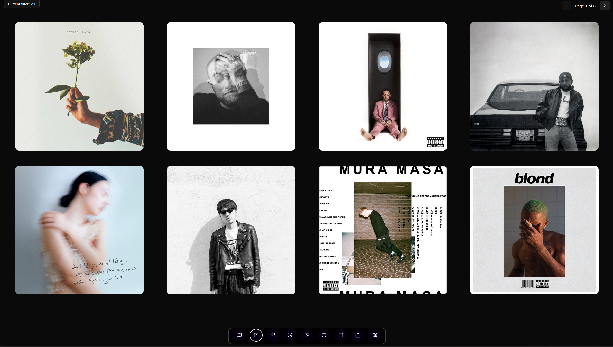
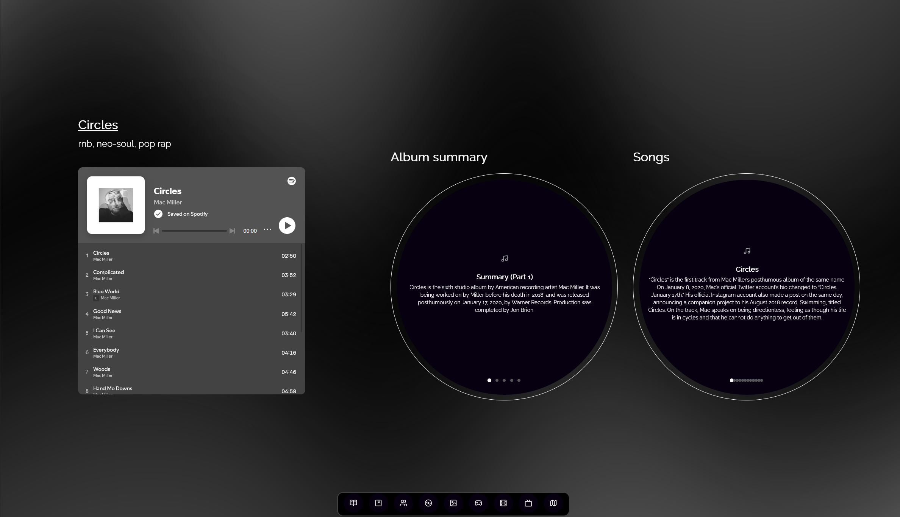
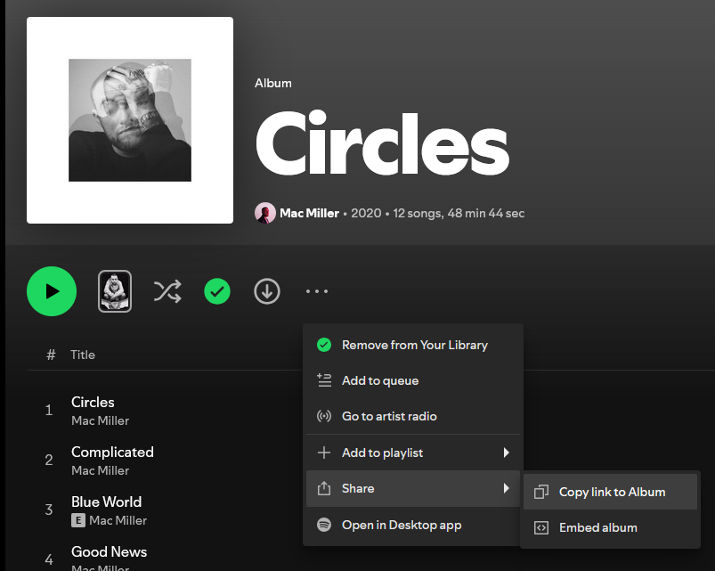
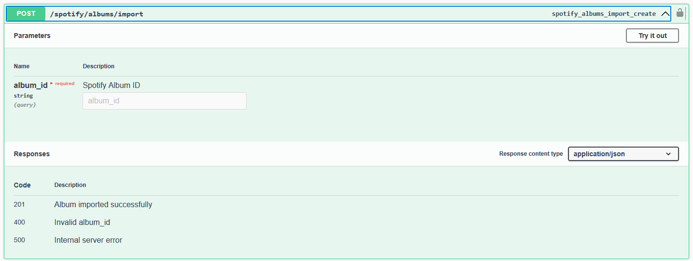

# Albums page

## What is it?

This page will list all of my favorite albums. There is a maximum of 8 albums per page. The user can also filter the albums based on albums genres and scroll through the different pages.

The user can also click on an album cover which will redirect them to the page of the specific album.

### External APIs used

- [Spotify Web API](https://developer.spotify.com/documentation/web-api)
- [LastFM API](https://www.last.fm/api)

### Album's page

Let's take Mac Miller's Circles album as an example :

The page contains three sections from left to right :

- Album's Spotify Embed : Spotify embeded player for the album. You will also see the "Genres" of the album right above
- Album's Summary : This is a carousel that contains a summary/summaries of the album. These summaries are fetched from the _LastFM API_
- Album's Songs summaries : For each song of the album I also fetch it's summary from the _LastFM API_

#### Details :

- The background has an _aurora_ effect based on the colors of the album's cover.
- You can slide between the different _pages_ of the carousel.
- The Spotify embeded player does not work on Firefox because of it does not support cross-site cookies.

## To add an album

To add an album to the database, I have to look for it's Spotify unique ID which you can find either on the Spotify web app or the Spotify Desktop app.

Here is an example :

https://open.spotify.com/album/5sY6UIQ32GqwMLAfSNEaXb?si=e6wnnyuyTom3r3atceq5Cg

In this case, the unique ID is : 5sY6UIQ32GqwMLAfSNEaXb

I then have a Swagger page where I paste the Spotify unique ID which triggers my import_album endpoint.

Here are some other endpoints that I use for albums :

### How it works on the technical side

Right now when adding an album here are the different things happening in the background :

1. Retrieve the songs, album's cover, artists info (name, follower count, popularity, profile picture) from the _Spotify Web API_
2. Call the album, artist and track endpoints of lastFM to retrieve additional information about each of these. (Summaries, Genres)
3. Create the different objects in the database. (Album, Songs, Artists, Genres)
