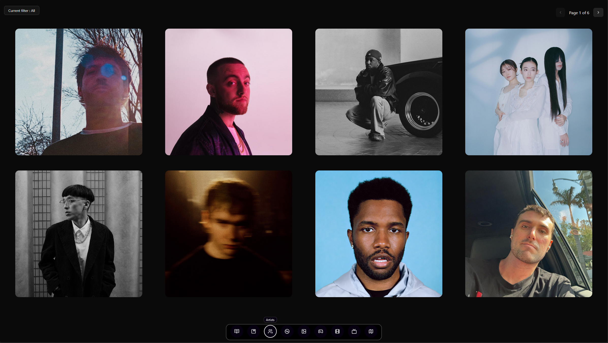
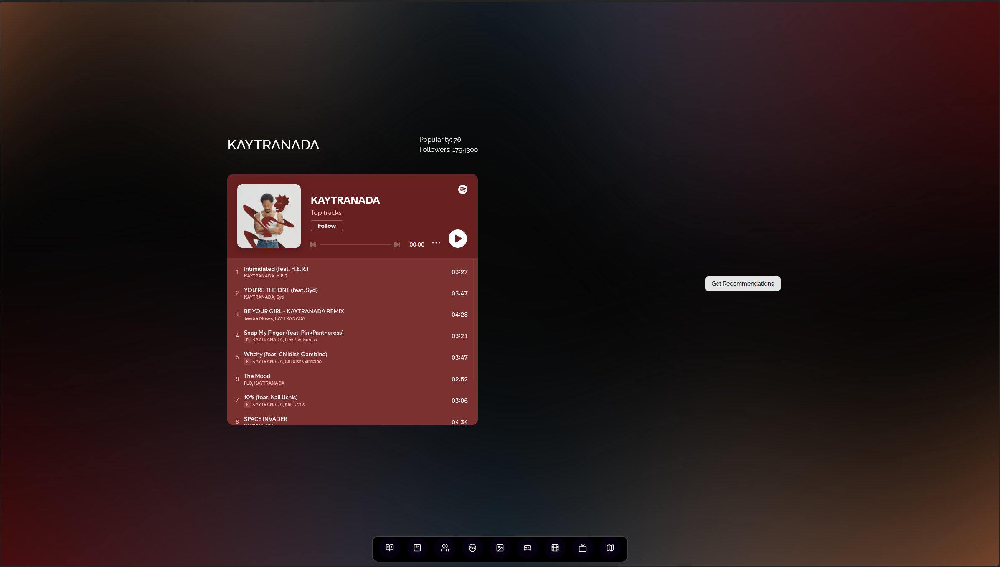
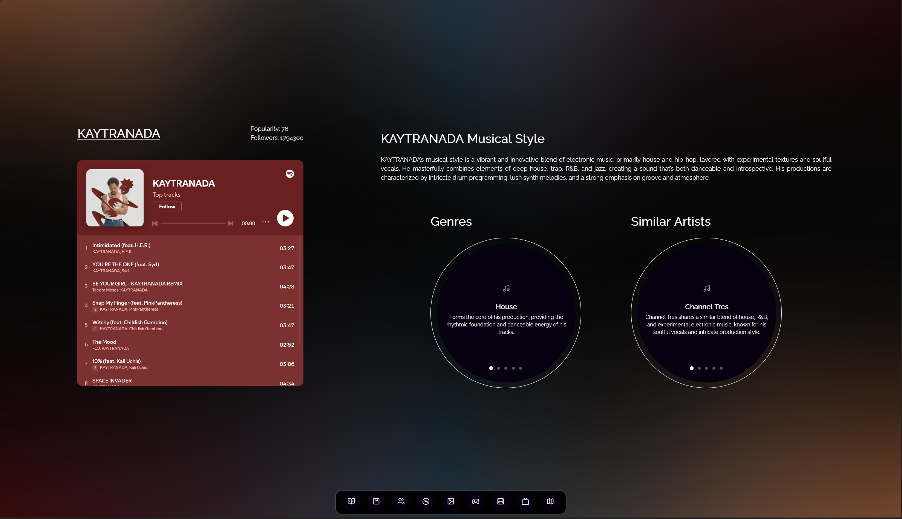
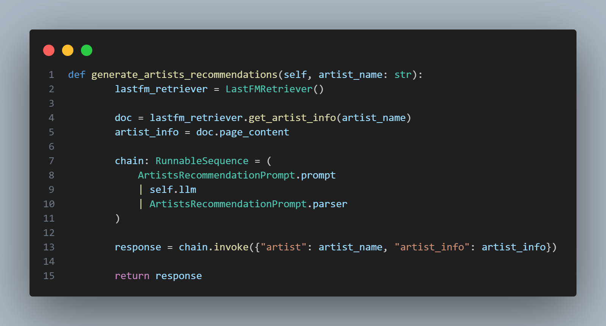
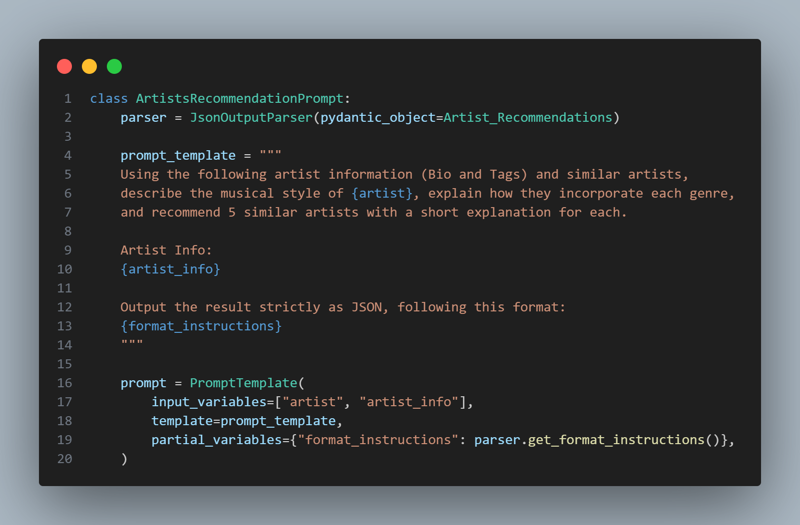
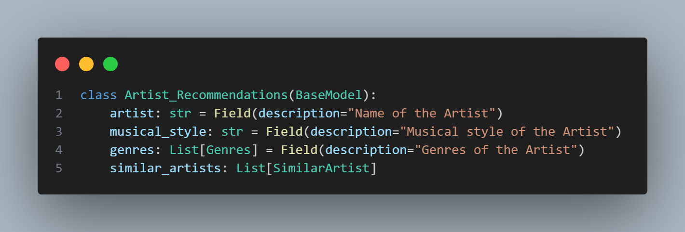

# Artists page

## What is it?

This page will list all of my favorite artists. There is a maximum of 8 albums per page. The user can also filter the artists based on artist's genres and scroll through the different pages.

The user can also click on the profile picture of an artist which will redirect them to the artist's page.

### External APIs used

- [Spotify Web API](https://developer.spotify.com/documentation/web-api)
- [LastFM API](https://www.last.fm/api)

### Artist's page

Let's take Kaytranada as an example.

The page initially contains 2 sections

- The Spotify embeded player
- A "Get Recommendations" button

#### Recommendations?

When clicking on the "Get Recommendations" Button it will call an LLM (Gemma3 using Ollama right now) and ask this prompt :

Using the following artist information (Bio and Tags) and similar artists, describe the musical style of {artist}, explain how they incorporate each genre, and recommend 5 similar artists with a short explanation for each.

The artist bio and tags and similar artists are being fetched from the _LastFM API_ in real time to have the most up to date data.

#### Results :

**Musical style :**
Kaytranada's musical style is a complex and highly influential blend of electronic music, primarily house and hip-hop, infused with experimental textures and a distinctive rhythmic sensibility. He expertly layers soulful vocals, chopped-up samples, and intricate beats to create a sound that is both danceable and deeply introspective. His production is characterized by its meticulous detail, vibrant sound design, and a strong emphasis on groove.

**Genres :**

- **House** : Forms the core of his production, providing the foundational rhythmic structure and energetic feel.
- **Hip-Hop** : He frequently incorporates hip-hop elements like vocal chops, 808s, and lyrical flows, creating a seamless fusion of genres.
- **Electronic** : Underpins the entire sound, utilizing synthesizers, drum machines, and effects to create unique textures and sonic landscapes.
- **Experimental** : His work often pushes boundaries with unusual samples, rhythmic variations, and unconventional song structures.

**Similar Artists :**

- **Channel Tres** : Channel Tres shares Kaytranada's knack for blending house music with soulful vocals and introspective lyrics, often creating similarly hazy and atmospheric tracks.
- **GoldLink** : GoldLink's production frequently incorporates elements of hip-hop, R&B, and electronic music, with a similar focus on melodic hooks and infectious grooves.
- **KAYTRAMINÉ** : KAYTRAMINÉ is a project of Kaytranada, featuring remixes and collaborations that further explore his signature sound and style.
- **NxWorries** : NxWorries (Kelvyn Marlone & Sam Herring) combines hip-hop, psychedelic rock, and funk, sharing Kaytranada's experimental approach to genre fusion.
- **The Internet** : The Internet's music—particularly Syd's vocals—aligns with Kaytranada's use of soulful vocals and laid-back, melodic production within a hip-hop context.

#### Details :

- The background has an _aurora_ effect based on the colors of the artists's profile picture.
- You can slide between the different _pages_ of the carousel.
- The Spotify embeded player does not work on Firefox because of it does not support cross-site

## To add an artist

For now I don't allow simply adding an artist.
Artists are only being added when adding an album.

## How it works on the technical side

I use a combination of Pydantic models, LangChain and Ollama (running locally) to handle prompts to the LLM.

Lets breakdown a little bit more in detail I ask and handle the interaction with the LLM.

### Ollama Client :

I have an Ollama_Client class that contains a function to generate_artists_recommendations :

- It starts by fetching some additionnal information about the Artist through the _LastFM API_
- It then calls the ArtistsRecommendationPrompt and passes the artist_name and the artist_info that was fetched at the previous step (line 13)

### Prompt :

You can see at the line 2, that I declare a parser which is in direct link with my Pydantic Model.

### Pydantic Model :

The role of the model is to structure the response from the LLM. Here is what I use to structure the response I receive from the LLM. You can see it as instructions.

Using this Pydantic Model, I can make sure that the response from the LLM is in the right JSON format that I then show on the frontend of the app.
