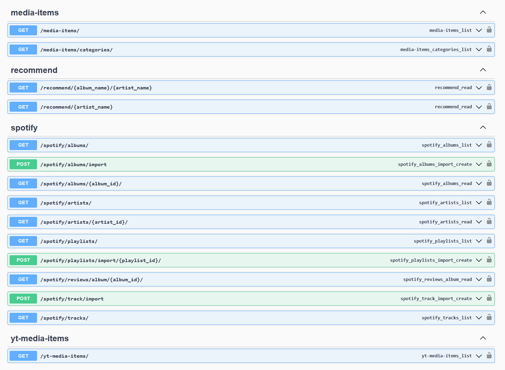
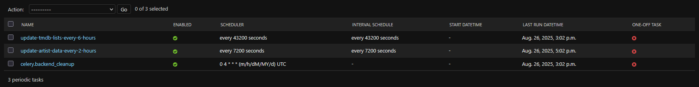
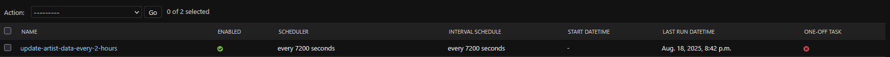
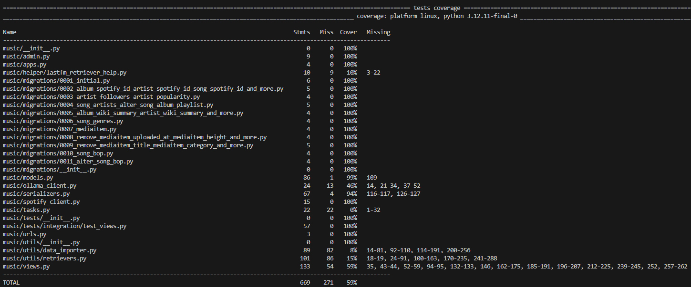

## What is this projet?

This is a personnal project I developped during the Summer 2025 to test my web application developpement skills.
It's a web application to store my favorite artists, albums, tracks/singles and on the other hand, Movies TVShows and games.
For now, everything is hosted locally so the content in the database won't be publicly available.

## Want to see what it looks like ?

[Small demo video](https://youtu.be/SeaWwgdMCVc)

## Features :

- [Albums](albums/albums.md)
- [Artists](artists/artists.md)
- [Tracks/Singles](tracks/tracks.md)
- [Pictures](pictures/pictures.md)
- [Movies & TVShows](media/media.md)
- [Games](games/games.md)
- [YTReco](ytReco/ytReco.md)

## Technologies used :

### Frontend

My frontend is in TypeScript (React) and I used Vite to setup my frontend.

I used some components from [ReactBits](https://github.com/DavidHDev/react-bits) and [shadcn](https://github.com/shadcn-ui/ui) to make the app prettier.
I also used some icons from [Lucide](https://lucide.dev/icons/)

### Backend

My backend was developped with Python(Django). I use models, serializers, views and urls to handle data.
I also have some automated tasks using a combination of Celery and Redis.

#### APIs

I used SpotifyWebAPI, LastFM API and YTMusicAPI to fetch the appropriate data.
I also used the SteamAPI for the Games section and TMDB API for the movies & TVshows section.
All the secrets are stored in a `.env` file.

##### Website API (Swagger)

To test my multiple endpoints I use Swagger. Thats also what I use to add data to my app for now.

##### Current endpoints :

#### Automated task

I use celery to handle the task which includes a worker and a beat and also a message broker (redis).
I also configured flower to monitor the queue, task progress and potential errors.

The tasks are also registered and can be seen in Django Admin :

### Database

I use a simple MySQL Database!

### Tests

I used pytest to develop a test suite for the backend. I simply created to markers `unit`and `integration` to specify the test types.

#### Test coverage as of 8/18/2025

### DevOps

I simply used Github Actions.

#### CI

- When there's a new push : .pre-commit.yaml launches, which runs linters (black, flake8, isort and prettier) and integration tests
- If the target branch is `main` it will then create a new image of the app and push it to DockerHub

#### CD

The CD pipeline might eventually get developped once I decided to host the web app.
