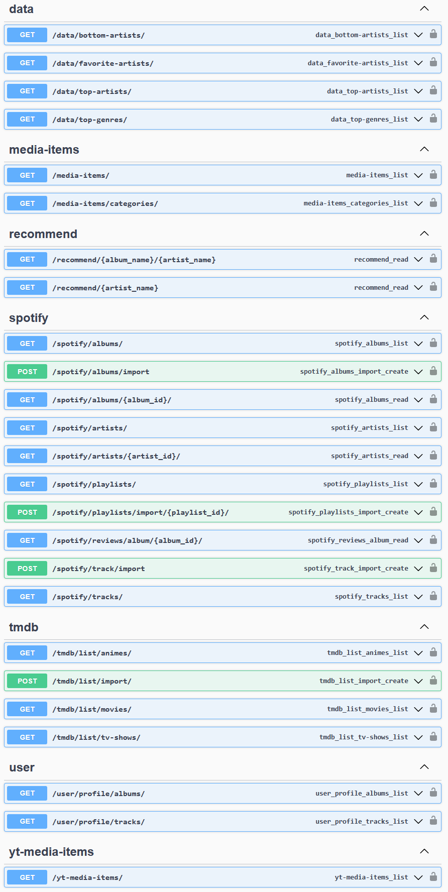

# ILikeToasts MR

Welcome to my repo!

## What is this projet?

This is a personnal project I developped during the Summer 2025 to test my web application developpement skills.
It's a web application to store my favorite artists, albums, tracks/singles and will eventually contain stuff like, trips, games etc.
For now, everything is hosted locally.

## Want to see what it looks like ?

https://youtu.be/SeaWwgdMCVc

## Technologies used :

### Frontend

My frontend is in React(TypeScript) and I used Vite to setup my frontend.

I used some components from [ReactBits](https://github.com/DavidHDev/react-bits) and [shadcn](https://github.com/shadcn-ui/ui) to make the app prettier. Both of those libraries are under the MIT License.

### Backend

My backend was developped with Python(Django). I use models, serializers, views and urls to handle data.
I also have a single task to update data automatically.

#### APIs

I used SpotifyWebAPI, LastFM API and YTMusicAPI to fetch the appropriate data.
All the secrets are stored in a `.env` file.

##### Website API (Swagger)

To test my multiple endpoints I use Swagger. Thats also what I use to add data to my app for now.

##### Current endpoints :

#### Automated task

I have a single automated task that runs every 2 hours to update artists data.
I use celery to handle the task which includes a worker and a beat and also a message broker (redis).

The task consists of updating the stored artists information : follower count, popularity, picture etc.
I also configured flower to monitor the queue, task progress and potential errors.

### Database

I use a simple MySQL Database!

### Tests

I used pytest to develop a test suite. I simply created to markers `unit`and `integration` to specify the test types.

#### Test coverage as of 8/18/2025

#### Here is an example of an integration test for a view :

### DevOps

I simply used Github Actions.

#### CI

- When there's a new push : .pre-commit.yaml launches, which runs linters (black, flake8, isort and prettier) and integration tests
- If the target branch is `main` it will then create a new image of the app and push it to DockerHub

#### CD

The CD pipeline might eventually get developped once I decided to host the web app.
