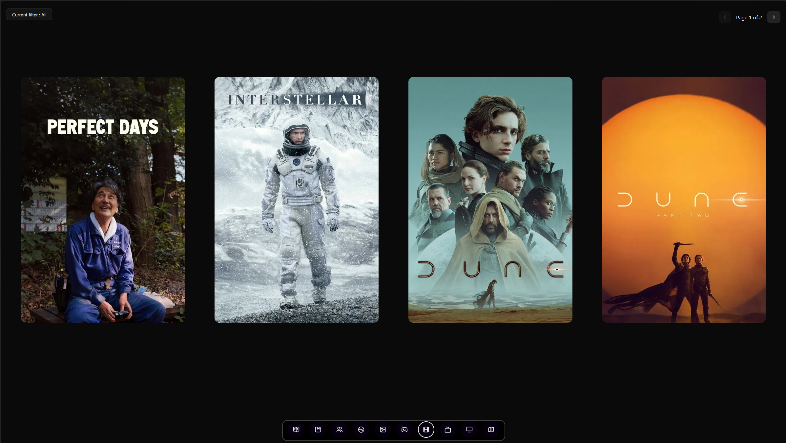
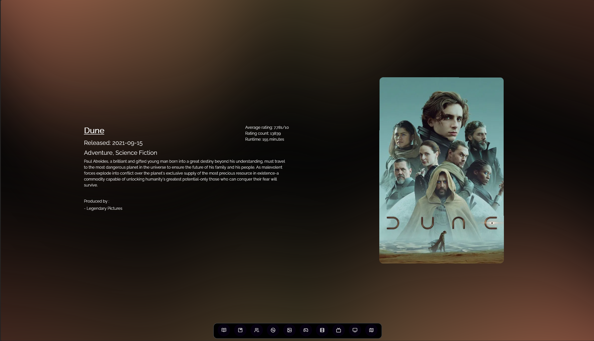
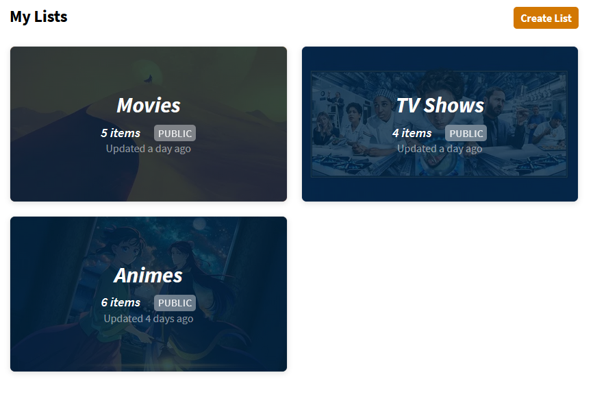
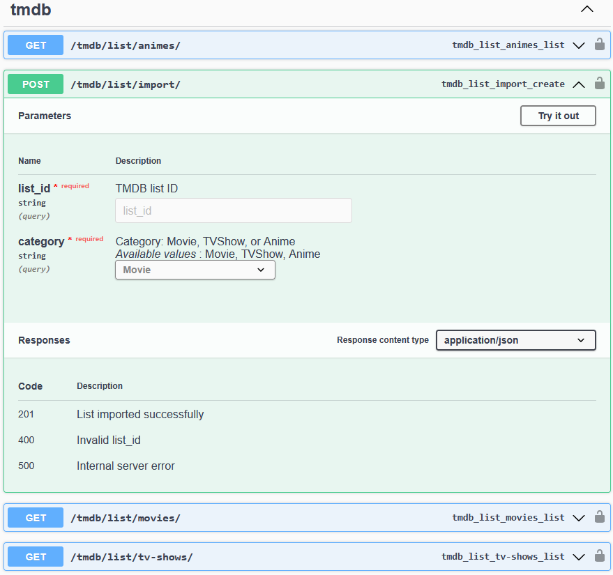
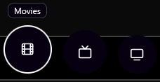

# Movies, series, animes page

## What is it?

To represent these three different sections I will take the movies page to showcase the feature.

This page will list all of my favorite movies, series and animes. There is a maximum of 4 movies per page. The user can also filter the movies based on movie's genres and scroll through the different pages.

The user can also click on the profile poster of each movie which will redirect them to the movie's page.

### External APIs used

- [TMDB API](https://developer.themoviedb.org/docs/getting-started)

### Movie's page

The page has two sections :

#### Left section

This section contains the following fields :

- Title
- Release date
- Genres
- Summary
- Production companies
- Average rating
- Rating count
- Runtime

\*There is a slight variation for TVShows for the following fields :

- Release date -> First episode release date
- Runtime -> Seasons count
- New field : Status (finished/in-production)

#### Right section

A simple card component containing the movie's poster

### To add media items

As mentionned above, I used the TMDB API to fetch information about the media items I add to my database.

The first step to import data is to create a list on the [TMDB Website](https://www.themoviedb.org/?language=en-CA).

I personnally separated my lists into these categories :

I then created these 4 endpoints where the post method takes in the TMDB list ID and has to be categorized between one of the three options :

Then on the frontend I simply separated these categories into three different pages:
From left to right -> movies, series, animes

The appropriate GET method is called depending of the page the user is.

