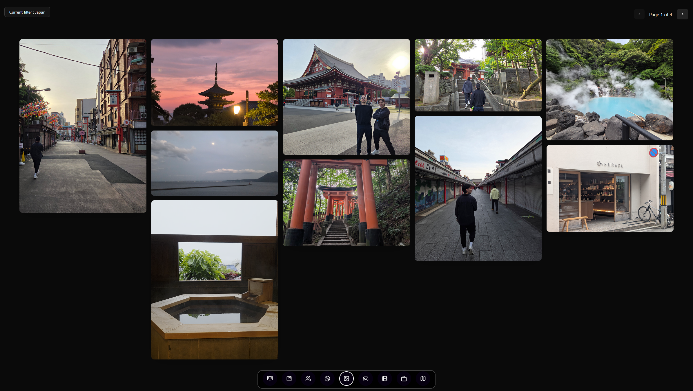

# Pictures page

I modified the following [Masonry](https://reactbits.dev/components/masonry) component from ReactBits to create my "Pictures" page.

I modified it to also be able to display videos.

All the media items have a specific category that you can filter at the top-left of the screen.

The page also uses a pagination logic when retrieving and loading items to make the page feel more fluid. I currently limit it to 10 components per page.
