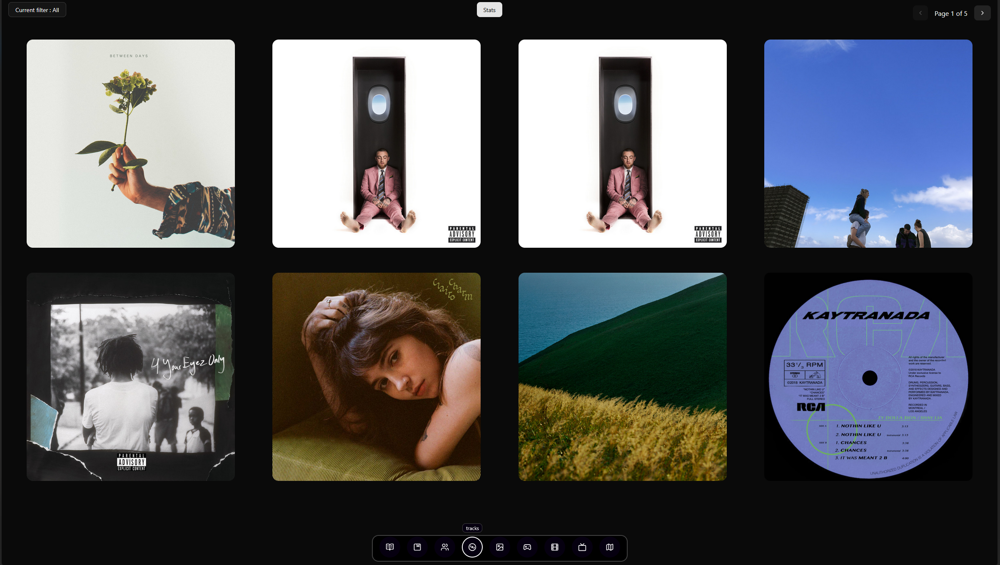
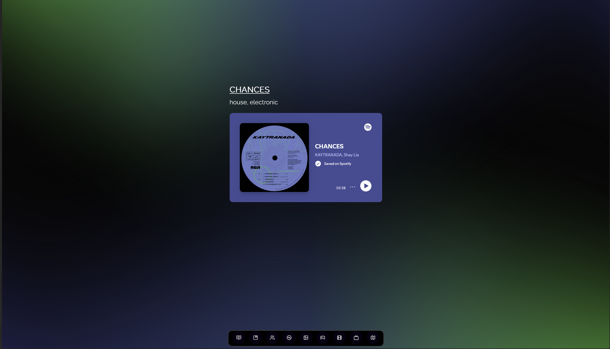
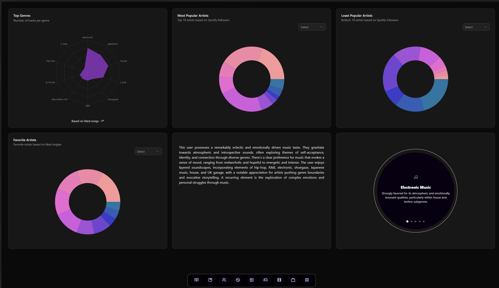

# Tracks/Singles page

## What is it?

This page will list all of the singles or specific tracks that I particularly enjoy. There is a maximum of 8 tracks per page. The user can also filter the tracks based on track's genres and scroll through the different pages.

The user can also click on the track's cover which will redirect them to the track's page.

For this page specifically I also implemented a stats button that will display some graphs and statistics based on the tracks in this section. More info in the Tracks Stats section of the wiki.

### Track's page

### Tracks Stats page

This page currently has a total of 6 cards : 4 cards with graphs, 1 with a button and 1 that will appear if the button "Get Music Profile" is clicked.

In order from left to right, top to bottom here is the content in each card :

- **Top Genres** : Most frequent genres found in the singles/tracks section
- **Most Popular Artists** : Top 10 artist with the highest count of Spotify followers
- **Least Popular Artists** : Bottom 10 artist with the lowest count of Spotify followers
- **Favorite Artists** : Top 10 artists with the highest count of songs in this section
- **Music Profile** : Music profile based on tracks. The paragraph is generated by an LLM
- **Music Profile expanation through genres** : Carousel containing the genres that define me the most with an explanation
